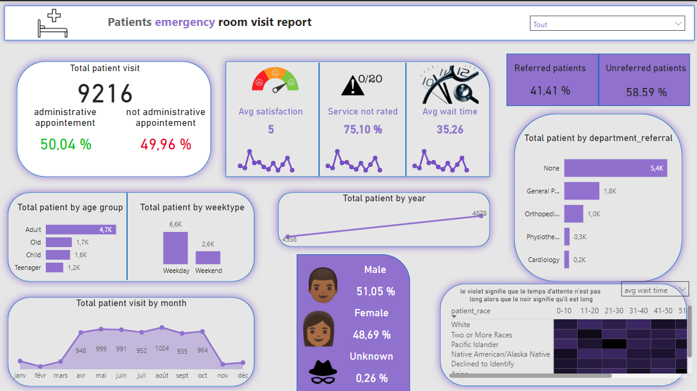

# Dashboard Patient Emergence Visit

The dashboard provides a comprehensive analysis of patient visits, highlighting key metrics such as total visits, average satisfaction, and wait times. It includes insights on referred vs. unreferred patients, gender distribution, and patient demographics by age group. Additionally, it tracks visit trends by month, week type, and year, as well as department and referral distribution. A heatmap visualizes patient wait times across different races, enabling data-driven decision-making for improving patient experience and operational efficiency.

Le tableau de bord fournit une analyse complète des visites des patients, mettant en évidence des indicateurs clés tels que le nombre total de visites, la satisfaction moyenne et les temps d'attente. Il inclut des informations sur les patients référés et non référés, la répartition par sexe et les données démographiques des patients par groupe d'âge. De plus, il suit les tendances des visites par mois, type de semaine et année, ainsi que la répartition par département et référence. Une carte thermique visualise les temps d'attente des patients en fonction des différentes races, permettant une prise de décision basée sur les données pour améliorer l'expérience des patients et l'efficacité opérationnelle.

